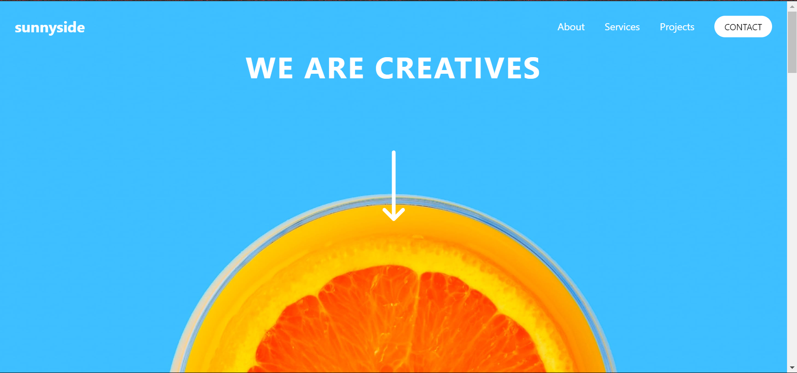

# Frontend Mentor - Sunnyside agency landing page solution

This is a solution to the [Sunnyside agency landing page challenge on Frontend Mentor](https://www.frontendmentor.io/challenges/sunnyside-agency-landing-page-7yVs3B6ef). Frontend Mentor challenges help you improve your coding skills by building realistic projects.

## Table of contents

- [Overview](#overview)
  - [The challenge](#the-challenge)
  - [Screenshot](#screenshot)
- [My process](#my-process)
  - [Built with](#built-with)
  - [What I learned](#what-i-learned)
  - [Continued development](#continued-development)
  - [Useful resources](#useful-resources)
- [Author](#author)
- [Acknowledgments](#acknowledgments)

## Overview

### The challenge

Users should be able to:

- View the optimal layout for the site depending on their device's screen size
- See hover states for all interactive elements on the page

### Screenshot

## My process

### Built with

- Semantic HTML5 markup
- CSS custom properties
- Flexbox
- CSS Grid
- Mobile-first workflow
- [Tailwind CSS](https://tailwindcss.com/) - For styles

### What I learned

- Throughout this project, I reinforced my skills in responsive web design and the use of utility-first CSS frameworks like Tailwind CSS. 
- One of the key learnings was the effective use of Tailwind's responsive design features and handling mobile navigation with a simple JavaScript toggle.

### Continued development

- For future projects, I aim to delve deeper into the use of Tailwind CSS for building complex layouts and animations. 
- Additionally, I plan to explore more JavaScript frameworks to enhance the interactivity of my web applications.

### Useful resources

- Tailwind CSS Documentation(https://tailwindcss.com/docs/installation) - This helped me understand the utility-first approach of Tailwind CSS. I would recommend it to anyone still learning this framework.

## Author

- Website - [Frontend Mentor | Sunnyside agency landing page](https://github.com/PhoEniX1704)
- Frontend Mentor - [@PhoEniX1704](https://www.frontendmentor.io/profile/PhoEniX1704)

## Acknowledgments

I'd like to thank the Frontend Mentor community for their support and feedback throughout this project. Their insights were invaluable in improving the quality of my work.
